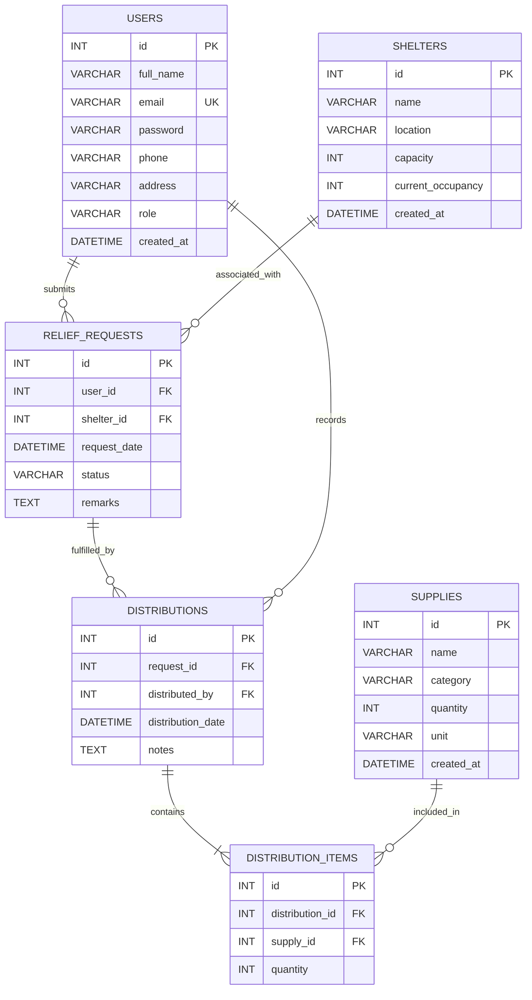

# Database Design Document

## Disaster Relief Distribution Management System

**Database name:** `disaster_relief_db`  
**Milestone:** 2 — Database Documentation  
**Status:** Approved logical design; SQL implementation deferred

---

## 1. Overview

This document defines the logical relational design for the Disaster Relief Distribution Management System. The design supports user accounts, shelter records, supply inventory, victim relief requests, recorded distributions, and the individual supply items contained in each distribution.

The database contains six tables:

- `users`
- `shelters`
- `supplies`
- `relief_requests`
- `distributions`
- `distribution_items`

---

## 2. Entity Descriptions

| Entity | Description |
|---|---|
| `users` | Stores accounts for administrators and victims. A user may submit relief requests; administrators record distributions. |
| `shelters` | Stores details and occupancy information for relief shelters. |
| `supplies` | Stores the current inventory of relief supplies. |
| `relief_requests` | Stores assistance requests submitted by victims and the shelter associated with each request. |
| `distributions` | Records the fulfillment activity for a relief request, including the administrator who recorded it. |
| `distribution_items` | Stores the supply items and quantities included in each distribution. It resolves the many-to-many relationship between distributions and supplies. |

---

## 3. Attribute Descriptions and Data Dictionary

### 3.1 `users`

| Attribute | Data type | Key | Null | Description | Constraints |
|---|---|---|---|---|---|
| `id` | INT | PK | No | Unique identifier for a user. | Positive, system-generated identifier. |
| `full_name` | VARCHAR(150) | — | No | User's full name. | Required. |
| `email` | VARCHAR(255) | Unique | No | User's email address used for authentication. | Required; unique. |
| `password` | VARCHAR(255) | — | No | Securely hashed user password. | Required; plaintext passwords must not be stored. |
| `phone` | VARCHAR(30) | — | No | User's contact number. | Required. |
| `address` | VARCHAR(500) | — | No | User's address. | Required. |
| `role` | VARCHAR(10) | — | No | User access role. | Allowed values: `admin`, `victim`. |
| `created_at` | DATETIME | — | No | Date and time the account was created. | Required. |

### 3.2 `shelters`

| Attribute | Data type | Key | Null | Description | Constraints |
|---|---|---|---|---|---|
| `id` | INT | PK | No | Unique identifier for a shelter. | Positive, system-generated identifier. |
| `name` | VARCHAR(150) | — | No | Shelter name. | Required. |
| `location` | VARCHAR(255) | — | No | Shelter address or location description. | Required. |
| `capacity` | INT | — | No | Maximum number of people the shelter can accommodate. | Must be greater than or equal to zero. |
| `current_occupancy` | INT | — | No | Current number of people accommodated at the shelter. | Must be between zero and `capacity`, inclusive. |
| `created_at` | DATETIME | — | No | Date and time the shelter record was created. | Required. |

### 3.3 `supplies`

| Attribute | Data type | Key | Null | Description | Constraints |
|---|---|---|---|---|---|
| `id` | INT | PK | No | Unique identifier for a supply record. | Positive, system-generated identifier. |
| `name` | VARCHAR(150) | — | No | Supply name, such as rice, water, or medicine. | Required. |
| `category` | VARCHAR(100) | — | No | Classification of the supply. | Required. |
| `quantity` | INT | — | No | Current available inventory quantity. | Must be greater than or equal to zero. |
| `unit` | VARCHAR(50) | — | No | Unit used to measure the quantity, such as packet, bottle, or kg. | Required. |
| `created_at` | DATETIME | — | No | Date and time the supply record was created. | Required. |

### 3.4 `relief_requests`

| Attribute | Data type | Key | Null | Description | Constraints |
|---|---|---|---|---|---|
| `id` | INT | PK | No | Unique identifier for a relief request. | Positive, system-generated identifier. |
| `user_id` | INT | FK | No | Victim who submitted the request. | References `users.id`. |
| `shelter_id` | INT | FK | No | Shelter associated with the request. | References `shelters.id`. |
| `request_date` | DATETIME | — | No | Date and time the relief request was submitted. | Required. |
| `status` | VARCHAR(10) | — | No | Current request-processing status. | Allowed values: `Pending`, `Approved`, `Rejected`, `Completed`. |
| `remarks` | TEXT | — | Yes | Additional information about the request. | Optional. |

### 3.5 `distributions`

| Attribute | Data type | Key | Null | Description | Constraints |
|---|---|---|---|---|---|
| `id` | INT | PK | No | Unique identifier for a distribution record. | Positive, system-generated identifier. |
| `request_id` | INT | FK | No | Relief request fulfilled by the distribution. | References `relief_requests.id`. |
| `distributed_by` | INT | FK | No | Administrator who recorded the distribution. | References `users.id`; user must have role `admin`. |
| `distribution_date` | DATETIME | — | No | Date and time the distribution occurred. | Required. |
| `notes` | TEXT | — | Yes | Additional notes about the distribution. | Optional. |

### 3.6 `distribution_items`

| Attribute | Data type | Key | Null | Description | Constraints |
|---|---|---|---|---|---|
| `id` | INT | PK | No | Unique identifier for a distribution item. | Positive, system-generated identifier. |
| `distribution_id` | INT | FK | No | Distribution to which this item belongs. | References `distributions.id`. |
| `supply_id` | INT | FK | No | Supply included in the distribution. | References `supplies.id`. |
| `quantity` | INT | — | No | Quantity of the supply distributed. | Must be greater than zero. |

---

## 4. Primary Keys

Each entity has a single-column primary key named `id`:

| Table | Primary key |
|---|---|
| `users` | `id` |
| `shelters` | `id` |
| `supplies` | `id` |
| `relief_requests` | `id` |
| `distributions` | `id` |
| `distribution_items` | `id` |

---

## 5. Foreign Keys

| Child table | Foreign key | Parent table | Referenced key | Meaning |
|---|---|---|---|---|
| `relief_requests` | `user_id` | `users` | `id` | Identifies the victim submitting a request. |
| `relief_requests` | `shelter_id` | `shelters` | `id` | Identifies the shelter associated with a request. |
| `distributions` | `request_id` | `relief_requests` | `id` | Identifies the request being fulfilled. |
| `distributions` | `distributed_by` | `users` | `id` | Identifies the administrator recording the distribution. |
| `distribution_items` | `distribution_id` | `distributions` | `id` | Identifies the parent distribution. |
| `distribution_items` | `supply_id` | `supplies` | `id` | Identifies the supplied inventory item. |

Foreign-key deletion should be restricted when dependent historical records exist. This preserves request and distribution history and prevents orphan records.

---

## 6. Constraints

| Table | Constraint | Purpose |
|---|---|---|
| `users` | `email` is unique | Prevents duplicate accounts using the same email address. |
| `users` | `role` is limited to `admin` or `victim` | Enforces valid user roles. |
| `shelters` | `capacity >= 0` | Prevents invalid shelter capacities. |
| `shelters` | `0 <= current_occupancy <= capacity` | Prevents negative occupancy and over-capacity records. |
| `supplies` | `quantity >= 0` | Prevents negative inventory. |
| `relief_requests` | `status` is limited to `Pending`, `Approved`, `Rejected`, or `Completed` | Enforces valid request states. |
| `distribution_items` | `quantity > 0` | Requires a positive amount for every distributed item. |
| `distribution_items` | Unique (`distribution_id`, `supply_id`) | Prevents the same supply from appearing more than once in a single distribution. |
| All relationships | Required foreign keys | Ensures every request, distribution, and item is linked to valid parent records. |

---

## 7. Relationship Descriptions

| Relationship | Cardinality | Description |
|---|---|---|
| Users to relief requests | One-to-many | One victim may submit zero or many relief requests; each request belongs to one user. |
| Shelters to relief requests | One-to-many | One shelter may be associated with zero or many relief requests; each request references one shelter. |
| Relief requests to distributions | One-to-many | One request may have zero or many distribution records; each distribution fulfills one request. |
| Users to distributions | One-to-many | One administrator may record zero or many distributions; each distribution is recorded by one user. |
| Distributions to distribution items | One-to-many | One distribution contains one or more supply-item records; each item belongs to one distribution. |
| Supplies to distribution items | One-to-many | One supply may occur in zero or many distribution items; each item references one supply. |

`distributions` and `supplies` have a many-to-many relationship. `distribution_items` resolves this relationship and stores the quantity for each supply in a distribution.

---

## 8. Business Rules

1. Every user must have a unique email address and exactly one role: `admin` or `victim`.
2. Only users with the `victim` role may submit relief requests.
3. Each relief request must be associated with one valid victim and one valid shelter.
4. A relief request status must be one of: `Pending`, `Approved`, `Rejected`, or `Completed`.
5. Only users with the `admin` role may be recorded as `distributed_by` on a distribution.
6. A distribution must be associated with an existing relief request.
7. Every distribution must contain at least one `distribution_items` record before it is considered a completed distribution.
8. A supply can appear only once within a specific distribution.
9. Distribution-item quantities must be positive and must not exceed available supply inventory at the time of distribution.
10. Supply inventory must be reduced consistently when a distribution is recorded; inventory must never become negative.
11. Shelter occupancy cannot be negative or greater than shelter capacity.
12. Historical users, shelters, supplies, requests, and distributions that are referenced by related records must not be deleted.

---

## 9. Normalization Explanation

The design satisfies Third Normal Form (3NF).

- **First Normal Form (1NF):** Each table has a primary key, and every attribute stores a single atomic value. Repeating groups are avoided; for example, multiple supplies in a distribution are stored as separate `distribution_items` rows.
- **Second Normal Form (2NF):** Every non-key attribute depends on the whole primary key of its table. The tables use single-column primary keys, and all descriptive attributes relate directly to that key.
- **Third Normal Form (3NF):** Non-key attributes depend only on the key, not on other non-key attributes. User details are stored only in `users`, shelter details only in `shelters`, and supply details only in `supplies`. Requests and distributions store only foreign keys to these entities rather than duplicating names, locations, or contact details.

The `distribution_items` table is essential to 3NF because it separates the repeating list of supplies from `distributions` and captures the quantity that belongs to the specific distribution-supply relationship.

---

## 10. Final ER Diagram



---

## 11. Relational Schema

```text
USERS(
  id PK,
  full_name,
  email UNIQUE,
  password,
  phone,
  address,
  role CHECK IN ('admin', 'victim'),
  created_at
)

SHELTERS(
  id PK,
  name,
  location,
  capacity CHECK (capacity >= 0),
  current_occupancy CHECK (current_occupancy >= 0 AND current_occupancy <= capacity),
  created_at
)

SUPPLIES(
  id PK,
  name,
  category,
  quantity CHECK (quantity >= 0),
  unit,
  created_at
)

RELIEF_REQUESTS(
  id PK,
  user_id FK -> USERS.id,
  shelter_id FK -> SHELTERS.id,
  request_date,
  status CHECK IN ('Pending', 'Approved', 'Rejected', 'Completed'),
  remarks
)

DISTRIBUTIONS(
  id PK,
  request_id FK -> RELIEF_REQUESTS.id,
  distributed_by FK -> USERS.id,
  distribution_date,
  notes
)

DISTRIBUTION_ITEMS(
  id PK,
  distribution_id FK -> DISTRIBUTIONS.id,
  supply_id FK -> SUPPLIES.id,
  quantity CHECK (quantity > 0),
  UNIQUE(distribution_id, supply_id)
)
```

No SQL is included in this document. The schema is ready for SQL implementation upon approval.
